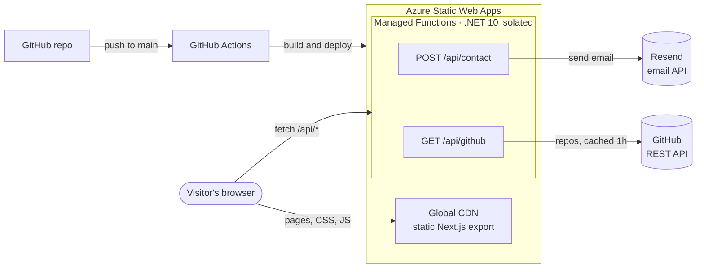

# Muhammad Maaz Salim: Developer Portfolio

My personal portfolio: a statically exported **Next.js** site with a small **C# Azure Functions** API, deployed together on **Azure Static Web Apps**.

<!-- TODO(stage 4): replace with the production URL once deployed. -->
**Live site:** _coming soon_

It is built to be fast and easy to skim for recruiters, and the repo is meant to show how I structure a real full-stack project: typed content, a tested API with services behind interfaces, and CI/CD.

## Highlights

- **Static front end:** Next.js (App Router) exported to plain HTML/CSS. No server rendering, about 1 KB of custom client JS for effects, and Lighthouse mobile scores of 98+ performance, 100 accessibility and 100 SEO on the compressed build.
- **C# API on managed Functions:** .NET 10 isolated worker with dependency injection, typed options, DTOs, server-side validation and source-generated structured logging.
- **Contact form:** validation, a honeypot field, per-IP rate limiting and email delivery through [Resend](https://resend.com). Errors use RFC 9457 problem details.
- **Live GitHub feed:** recently pushed repos, cached for an hour, with a last-known-good fallback if GitHub is unavailable.
- **57 xUnit tests:** validation, rate limiting, client IP parsing, both services (HTTP mocked) and both functions.
- **Content as data:** projects, experience and skills live in typed files under [`web/content`](web/content), so editing copy never means touching components.
- **Accessible and responsive:** semantic landmarks, skip link, visible focus states, AA contrast in both themes, light/dark mode with no flash on load, and full support for reduced motion.

## Architecture



The site and API share one origin, so the browser calls `/api/...` directly with no CORS setup. Secrets such as the Resend key exist only as Azure app settings and never reach the browser or the repo.

## Repository layout

```
.
├── web/                         Next.js front end (static export)
│   ├── app/                     Routes, layout, metadata, sitemap, OG image
│   │   └── projects/[slug]/     Case-study pages, generated from content
│   ├── components/
│   │   ├── sections/            Hero, Projects, Experience, Skills, About, Contact…
│   │   └── ui/                  Shared pieces: Section, TagList, ThemeToggle, icons…
│   ├── content/                 ← All site copy, as typed data
│   ├── lib/                     Typed API client, theme script
│   └── public/                  Resume PDF and static assets
├── api/
│   ├── Portfolio.Api/           Azure Functions app
│   │   ├── Functions/           HTTP triggers (thin: parse → delegate → respond)
│   │   ├── Services/            Email, GitHub, rate limiting (behind interfaces)
│   │   ├── Validation/          Contact form rules
│   │   ├── Models/              Request/response DTOs
│   │   ├── Options/             Strongly typed settings
│   │   └── Http/                Client IP resolution
│   └── Portfolio.Api.Tests/     xUnit tests
├── scripts/                     Repo tooling (e.g. placeholder finder)
├── swa-cli.config.json          Local Azure emulator config
└── package.json                 One-command scripts for the whole repo
```

## Running locally

### Prerequisites

- [Node.js](https://nodejs.org) 20 or newer
- [.NET SDK](https://dotnet.microsoft.com/download) 10

Azure Functions Core Tools and the Static Web Apps CLI are installed as project dev dependencies, so nothing needs installing globally.

### Setup

```bash
npm run setup
cp api/Portfolio.Api/local.settings.example.json api/Portfolio.Api/local.settings.json
```

`local.settings.json` is git-ignored. With `Resend__ApiKey` left empty, the API runs a log-only email sender in development: contact messages print to the terminal instead of being emailed.

### Start

```bash
npm run dev
```

Open **http://localhost:3000**. This starts the Next.js dev server (with live reload) and the Functions host on port 7071. In development, Next forwards `/api/*` to the Functions host. The first start takes about 30 seconds while the API compiles.

To run behind the Static Web Apps emulator, which applies Azure's routing exactly as production does, use `npm run dev:azure` and open http://localhost:4280. The emulator doesn't support live reload.

### Scripts

| Command | What it does |
|---|---|
| `npm run setup` | Install all dependencies (root, web, .NET) |
| `npm run dev` | Site + API with live reload, on :3000 |
| `npm run dev:azure` | Same, behind the SWA emulator, on :4280 |
| `npm run check` | Lint, typecheck, run tests, build everything. Run before pushing |
| `npm test` | API tests only |
| `npm run todo` | List placeholders that still need real content |

## Editing content

Everything visible on the site comes from [`web/content`](web/content):

| File | Controls |
|---|---|
| [`site.ts`](web/content/site.ts) | Name, title, pitch, About text, email, social links, site URL |
| [`projects.ts`](web/content/projects.ts) | Project cards **and** each `/projects/[slug]` case-study page |
| [`experience.ts`](web/content/experience.ts) | Experience timeline |
| [`skills.ts`](web/content/skills.ts) | Grouped skills |

[`types.ts`](web/content/types.ts) defines the shape of each, so TypeScript flags missing or misspelled fields.

## API

### `POST /api/contact`

```json
{ "name": "Ada", "email": "ada@example.com", "message": "Hello!", "website": "" }
```

| Status | When |
|---|---|
| `202 Accepted` | Message sent (also returned when the `website` honeypot is filled, so bots learn nothing) |
| `400 Bad Request` | Invalid JSON, or validation errors as a `ValidationProblemDetails` with per-field messages |
| `429 Too Many Requests` | Over the rate limit; includes a `Retry-After` header |
| `502 Bad Gateway` | The email provider rejected or couldn't be reached |

Only valid submissions count toward the rate limit (default: 3 per IP per 15 minutes), so a visitor fixing a typo is never locked out.

### `GET /api/github`

Returns the most recently pushed public, non-fork, non-archived repos:

```json
{
  "profileUrl": "https://github.com/maazsalim",
  "repos": [
    { "name": "…", "description": "…", "url": "…", "language": "C#", "stars": 0, "pushedAt": "2026-10-01T00:00:00+00:00" }
  ]
}
```

Responses are cached in memory and via `Cache-Control` for one hour. If GitHub fails after the cache expires, the last good response is served. With nothing cached it returns `502`, and the front end falls back to a plain link to the GitHub profile.

### Configuration

Set these as application settings (Azure portal → Static Web App → **Environment variables**) or in `local.settings.json` locally:

| Setting | Required | Description |
|---|---|---|
| `Resend__ApiKey` | Yes (prod) | Resend API key |
| `Resend__From` | Yes (prod) | Sender, e.g. `Portfolio <onboarding@resend.dev>` |
| `Resend__To` | Yes (prod) | Where contact messages are delivered |
| `GitHub__Username` | Yes | GitHub account to show |
| `GitHub__Token` | No | Raises the GitHub rate limit from 60 to 5,000 requests per hour |
| `ContactRateLimit__PermitLimit` | No | Messages per IP per window (default `3`) |
| `ContactRateLimit__Window` | No | Window length as a `TimeSpan`, e.g. `00:15:00` (default) |

## Deployment

<!-- TODO(stage 4): confirm these steps against the real workflow and staticwebapp.config.json once added. -->

The site deploys to **Azure Static Web Apps (Free plan)** through GitHub Actions on every push to `main`.

1. Create a Static Web App in the Azure portal: choose the **Free** plan and connect this GitHub repo and the `main` branch.
2. Build settings: app location `web`, output location `out`, API location `api/Portfolio.Api`.
3. Azure commits a GitHub Actions workflow to `.github/workflows/` and adds the deployment token as a repo secret.
4. Add the API settings from [Configuration](#configuration) under **Environment variables**.
5. Set `url` in [`web/content/site.ts`](web/content/site.ts) to the production address so canonical URLs, the sitemap and Open Graph tags are correct.

The Free plan includes the managed Functions API and costs nothing.

## Design notes and trade-offs

- **Rate limiting is in memory.** Each Functions instance keeps its own counters, which reset when an instance recycles. That's fine for a low-traffic contact form; strict limits would need a shared store such as Redis or Table Storage. Client IP headers can also be spoofed, so this is spam protection, not security.
- **Static export over server rendering.** Content changes only on deploy, so pre-rendered HTML is faster, cheaper and simpler. The two dynamic features (contact, GitHub feed) run through the API.
- **Effects are CSS-first.** The cursor glow and card highlights run on two CSS variables updated once per frame. Scroll reveals use CSS scroll-driven animations. All motion is off for `prefers-reduced-motion`, and browsers without support show static content.

## Credits

Layout inspired by [Brittany Chiang](https://brittanychiang.com)'s portfolio. The code is written from scratch, not forked from her template.
